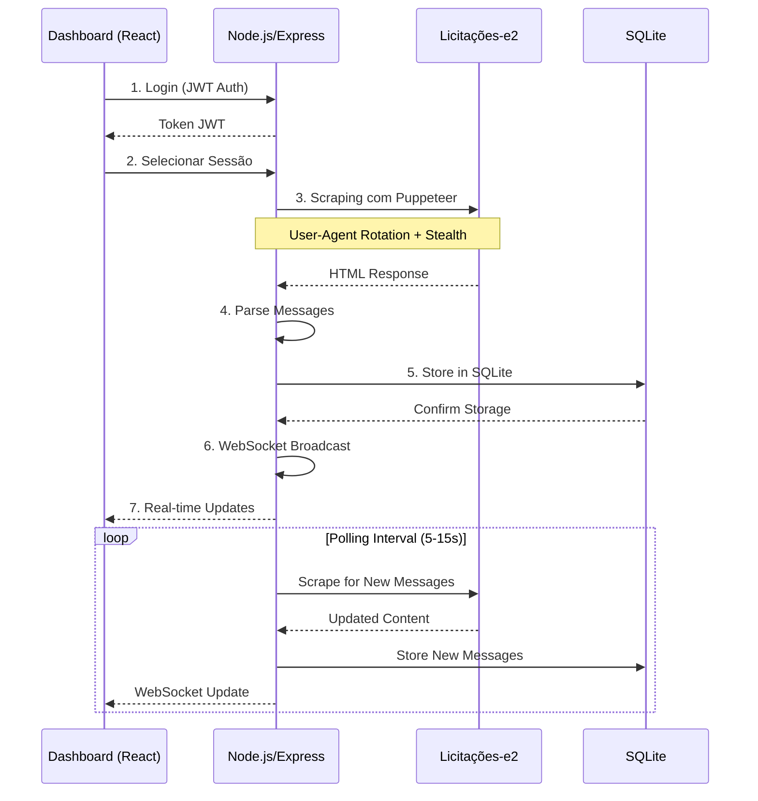

# Licita Sonar

A web application for monitoring public bidding chats on [Licitações-e2](https://licitacoes-e2.bb.com.br/) without official APIs, using ethical scraping techniques.

## Features

- Real-time dashboard with WebSocket updates
- Ethical scraping with anti-bot detection measures
- User authentication with JWT
- SQLite storage for messages
- LGPD compliance with local logging

## Architecture



## Anti-Bot Measures

1. User-Agent rotation with 20+ realistic strings
2. Stealth plugin for fingerprint evasion
3. Human-like behavior simulation (scrolling, clicking)
4. Randomized delays between requests
5. Error handling for 403/429 responses

## Requirements

- Node.js >= 14
- npm

## Installation

1. Clone the repository:
   ```bash
   git clone <repository-url>
   ```

2. Install dependencies:
   ```bash
   npm install
   ```

3. Copy and configure environment variables:
   ```bash
   cp .env.example .env
   # Edit .env with your settings
   ```

4. Start the development server:
   ```bash
   npm run dev
   ```

## Deployment

### Frontend Deployment (Vercel)

1. Create a new project on Vercel
2. Connect your GitHub repository
3. Configure the project:
   - Build Command: `npm run build` (if you have a build step) or use static deployment
   - Output Directory: `public`
   - Install Command: `npm install`
4. Add environment variables if needed
5. Deploy!

For static deployment, Vercel will automatically serve files from the `public` directory.

### Backend Deployment (Render)

1. Create a new Web Service on Render
2. Connect your GitHub repository
3. Configure the service:
   - Name: `licita-sonar-backend`
   - Runtime: Node
   - Build Command: `npm install`
   - Start Command: `npm start`
4. Add environment variables:
   - `ACCESS_TOKEN_SECRET`: Your JWT secret key
   - `NODE_ENV`: production
5. Deploy!

The `render.yaml` file in the repository provides these configurations automatically.

## API Usage

Once deployed, you can interact with the API:

1. Register a user:
   ```bash
   curl -X POST https://your-backend-url.onrender.com/api/auth/register \
     -H "Content-Type: application/json" \
     -d '{"username":"yourusername","password":"yourpassword"}'
   ```

2. Login to get a token:
   ```bash
   curl -X POST https://your-backend-url.onrender.com/api/auth/login \
     -H "Content-Type: application/json" \
     -d '{"username":"yourusername","password":"yourpassword"}'
   ```

3. Add a session to monitor:
   ```bash
   curl -X POST https://your-backend-url.onrender.com/api/sessions/add \
     -H "Content-Type: application/json" \
     -H "Authorization: Bearer YOUR_JWT_TOKEN" \
     -d '{"sessionId":"SESSION_ID_TO_MONITOR"}'
   ```

4. Get messages for a session:
   ```bash
   curl https://your-backend-url.onrender.com/api/sessions/SESSION_ID/messages \
     -H "Authorization: Bearer YOUR_JWT_TOKEN"
   ```

## Security & Compliance

- JWT authentication
- Input sanitization with DOMPurify
- Local logging for audit (LGPD compliant)
- No external data sharing

## Limitations

- Supports up to 10 concurrent sessions (SQLite/Render limitation)
- No proxy rotation (free tier restriction)
- Dependent on site structure stability

## License

MIT